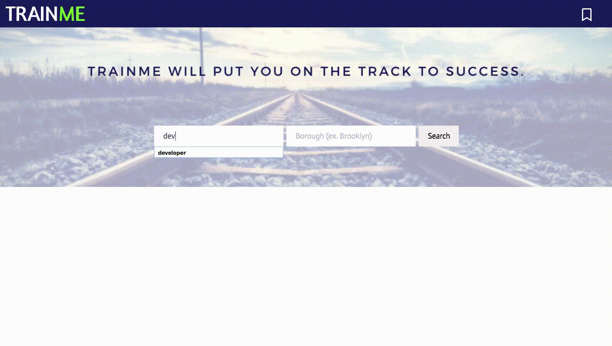

# TrainMe 

Connecting individuals looking to start a new career with vocational training resources. 


## Features 


Search for vocational classes you're interested in by typing in a keyword in our homepage. 




Browse through the courses available. Click on a course to get a detailed description of the course. You can even save the course to look at later. 


Look through your saved courses. 


## Getting Started

Follow these instructions to get a copy of the fullstack app running on local for development and testing purposes.


### Installation

```
git clone
cd trainme
npm i 
npm start
```


Open http://localhost:3000/ to view the app in a browser.


## Built With
* NYC Open Data: [Courses/Training Provider Listing](https://data.cityofnewyork.us/Business/Courses-Training-Provider-Listing/fgq8-am2v) - Listing of vocational training courses eligible for Individual Training Grants 
* [React](https://reactjs.org/) - JavaScript library 
* CSS/HTML 


## Contributors 
* [Helen](https://github.com/helencho)
* [Gerson](https://github.com/Acostill) 
* [Thomas](https://github.com/tek2master) 
* [Janette](https://github.com/ninja-nette)
* Our mentor, [Kenny](https://github.com/kenyo)


## Future Works 
* Implement financial resources 